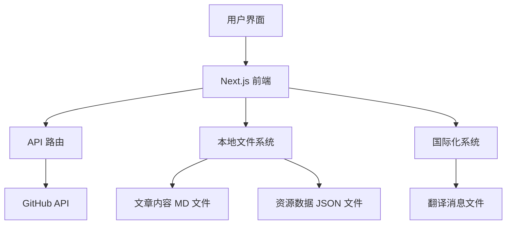
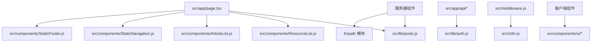
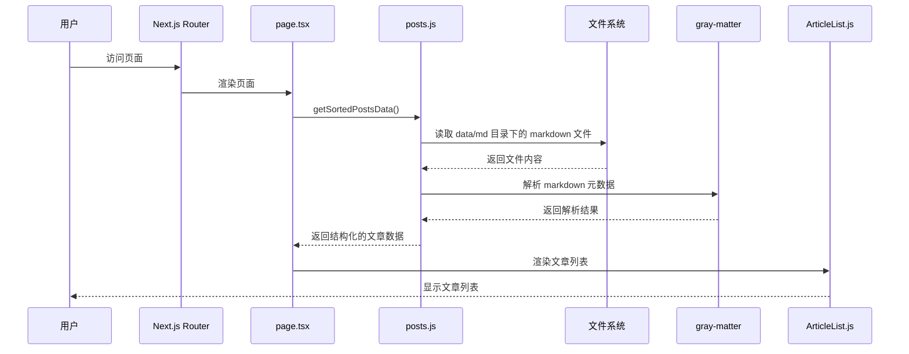
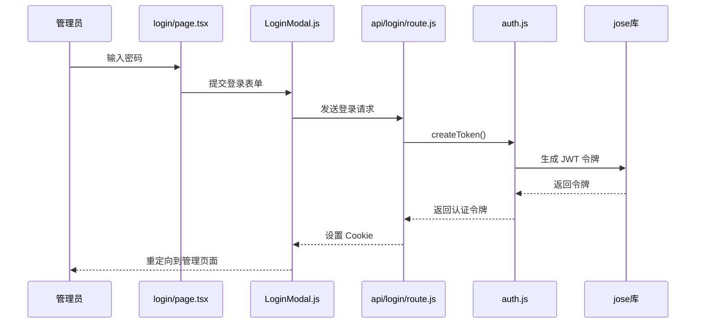

# GenerateGhibli

[GenerateGhibli](https://generateghibli.org/) 是您的吉卜力风格AI图像生成资源导航站。发现精选的AI工具、模型和灵感，轻松创建宫崎骏和吉卜力工作室风格的魔幻世界和角色。


## 部署在 Vercel

[](https://vercel.com/new/clone?repository-url=https%3A%2F%2Fgithub.com%2FGenerateGhibli%2FGenerateGhibli&project-name=GenerateGhibli&repository-name=GenerateGhibli&external-id=https%3A%2F%2Fgithub.com%2FGenerateGhibli%2FGenerateGhibli%2Ftree%2Fmain)

## 功能特点

- **全面的资源集合**：精选的吉卜力风格AI图像生成工具和模型
- **灵感画廊**：展示社区创作的吉卜力风格AI艺术作品
- **创作指南**：专为各种AI图像生成器优化的吉卜力风格提示词
- **模型推荐**：最适合创建吉卜力风格艺术的AI模型评测和推荐
- **多语言支持**：支持英文和中文
- **响应式设计**：使用Tailwind CSS实现的完全响应式设计
- **SEO优化**：通过服务器端渲染和增强元数据提升搜索引擎可见性
- **无数据库设计**：通过GitHub API和本地文件系统实现内容管理
- **轻量级依赖**：精简依赖结构，使用现代库如jose替代传统库

## 项目架构

GenerateGhibli采用Next.js框架构建，使用Tailwind CSS实现响应式设计，并通过GitHub API实现内容管理系统，无需传统数据库即可实现动态内容更新。



主要组件及其交互方式：

1. **前端页面**：使用Next.js的App Router架构，支持服务器组件和客户端组件混合使用
2. **内容管理**：通过GitHub API存储和管理网站内容
3. **国际化系统**：使用next-intl实现多语言支持
4. **认证系统**：基于JWT的简单认证系统，用于管理员访问
5. **静态内容渲染**：使用markdown和remark处理静态内容
6. **样式系统**：基于Tailwind CSS和Shadcn/UI组件库

## 代码文件依赖关系



## 功能模块调用逻辑

### 文章列表展示

当用户访问首页或文章列表页时，系统执行以下函数调用链：



### 管理员登录



## 最新开发进度

### 代码优化与依赖清理 (2025-04-17)

- **依赖清理与现代化**：
  - 移除了未使用的SWR依赖
  - 将jsonwebtoken库替换为更现代的jose库
  - 统一了所有JWT令牌处理逻辑，提高了安全性和一致性
  - 精简了整体依赖结构，提高了应用性能

- **项目文档增强**：
  - 添加了详细的项目架构图表
  - 增加了代码文件依赖关系说明
  - 添加了核心功能模块的调用逻辑时序图
  - 更新了关键代码文件索引和设计模式说明

### 国际化与管理功能优化 (2025-04-16)

- **国际化框架修复**：
  - 修复了客户端组件中的国际化上下文问题
  - 解决了`useTranslations`钩子在客户端组件中的错误
  - 使用`NextIntlClientProvider`正确包装客户端组件
  - 创建了`getMessages`辅助函数以简化国际化实现

- **管理界面重构**：
  - 重新设计了管理员仪表板页面
  - 实现了创建文章和管理资源的路由结构
  - 修复了管理页面和登录页面的404错误
  - 优化了页面间的导航流程

- **路由结构优化**：
  - 统一使用`[locale]`路由模式，确保所有页面支持国际化
  - 删除了冗余的非国际化路由
  - 修复了页面间导航的链接问题
  - 确保所有客户端路由跳转保留语言参数

- **组件架构改进**：
  - 将页面逻辑分离为服务器组件和客户端组件
  - 服务器组件负责数据获取和国际化配置
  - 客户端组件处理交互和状态管理
  - 提高了代码的可维护性和性能

### SEO优化 (2025-04-15)

- **服务器端渲染改进**：
  - 将客户端组件转换为服务器组件，提高搜索引擎索引效率
  - 创建静态组件替代带有"use client"指令的客户端组件
  - 实现了StaticResourceList、StaticArticleList和StaticGhibliNavigation等服务器组件

- **元数据增强**：
  - 更新所有page.tsx文件，添加全面的SEO元数据
  - 实现关键词、描述和OpenGraph数据，提高搜索可见性
  - 优化标题和描述以提高点击率

- **路由优化**：
  - 实现文章详情页面的正确路由，修复404错误
  - 添加[locale]/posts/[id]/page.tsx路由结构
  - 创建示例文章内容，提供吉卜力风格AI艺术指南

- **可访问性改进**：
  - 实现适当的HTML语义结构
  - 添加ARIA属性，提高可访问性
  - 在静态组件中实现国际化支持

## 关键代码文件

### 核心文件

| 文件路径 | 描述 |
|---------|------|
| src/app/page.tsx | 网站首页，负责加载和展示资源列表与文章列表 |
| src/lib/posts.js | 处理markdown文章的核心功能模块，包括获取文章列表和文章详情 |
| src/lib/auth.js | 认证相关功能，包括JWT令牌生成和验证 |
| src/i18n.js | 国际化配置，定义支持的语言和默认语言 |
| src/components/ResourceList.js | 展示资源列表的组件 |
| src/components/ArticleList.js | 展示文章列表的组件 |

### API路由

| 文件路径 | 描述 |
|---------|------|
| src/app/api/login | 处理管理员登录请求 |
| src/app/api/logout | 处理登出请求 |
| src/app/api/check-auth | 验证认证状态 |
| src/app/api/articles | 文章管理API |
| src/app/api/resources | 资源管理API |

## 前提条件

- Node.js (14版本或更高)
- npm (随Node.js一起安装)
- Git
- GitHub账户
- Vercel账户 (用于部署)

## 安装

1. 克隆仓库:
   ```
   git clone https://github.com/GenerateGhibli/GenerateGhibli.git
   cd GenerateGhibli
   ```

2. 安装依赖:
   ```
   npm install
   ```

3. 在根目录创建`.env.local`文件并添加以下内容:
   ```
   GITHUB_TOKEN=your_github_personal_access_token
   GITHUB_OWNER=your_github_username
   GITHUB_REPO=your_repo_name
   ACCESS_PASSWORD=your_secure_access_password
   JWT_SECRET=your_secret_key_for_token_generation
   ```

4. 设置GitHub仓库:
   - 在GitHub上创建一个新仓库
   - 在仓库中创建两个文件夹: `data/json` 和 `data/md`
   - 在 `data/json` 中创建一个名为 `resources.json` 的文件，内容为空数组: `[]`

5. 运行开发服务器:
   ```
   npm run dev
   ```

访问 `http://localhost:3000` 查看本地运行的GenerateGhibli实例。

## 设计模式与命名约定

- **文件命名**：组件使用PascalCase（如ResourceList.js），实用程序模块使用camelCase（如posts.js）
- **国际化**：静态组件接受locale参数，客户端组件使用useTranslations钩子
- **组件分离**：客户端交互组件与服务器渲染组件分离，服务器组件名称前缀为Static
- **API结构**：采用REST风格的API设计
- **数据流**：自顶向下的数据流，父组件通过props向子组件传递数据
- **认证方式**：使用jose库实现基于JWT的无状态认证

## 资源分类

- **工具**: 用于生成吉卜力风格图像的AI工具和平台
- **模型**: 为吉卜力美学风格优化的AI模型
- **灵感**: 吉卜力风格AI艺术创作的灵感来源
- **提示词**: 创建特定吉卜力元素的优化提示词

## 贡献

我们欢迎对GenerateGhibli的贡献！请访问我们的[GitHub仓库](https://github.com/GenerateGhibli/GenerateGhibli)提交问题或拉取请求。

## 许可证

GenerateGhibli是根据[MIT许可证](https://github.com/GenerateGhibli/GenerateGhibli/?tab=MIT-1-ov-file)授权的开源软件。

## 支持

如果您遇到任何问题或有疑问，请在GitHub仓库上提交issue。

## 致谢

GenerateGhibli使用以下开源库构建:
- [Next.js](https://nextjs.org/)
- [Tailwind CSS](https://tailwindcss.com/)
- [Shadcn/UI](https://ui.shadcn.com/)
- [next-intl](https://next-intl-docs.vercel.app/)
- [Jose](https://github.com/panva/jose)
- [Octokit](https://github.com/octokit/octokit.js)

我们感谢这些项目的维护者和贡献者。
